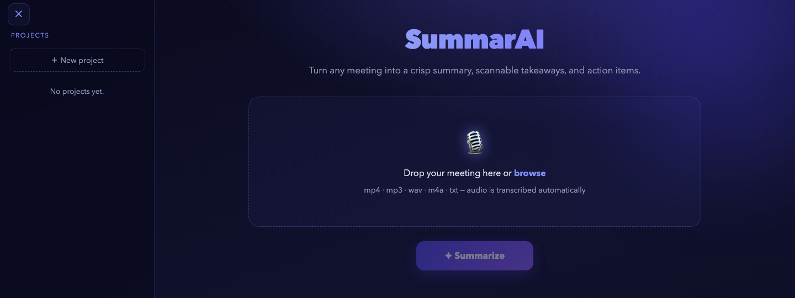
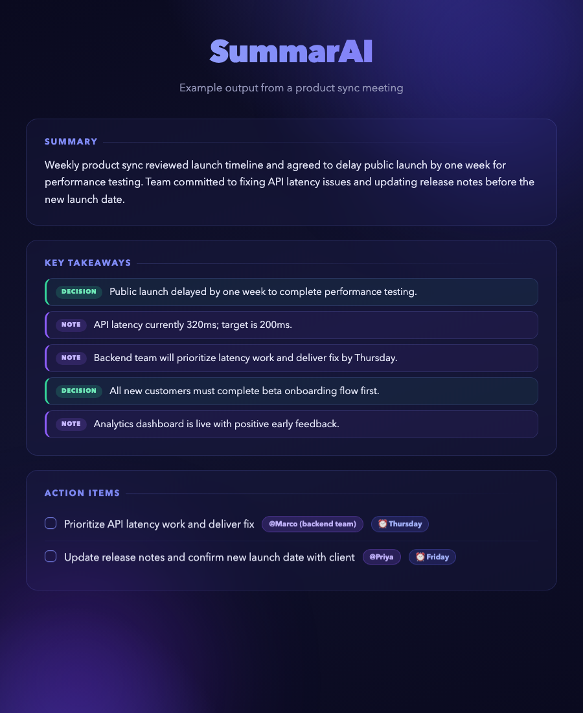
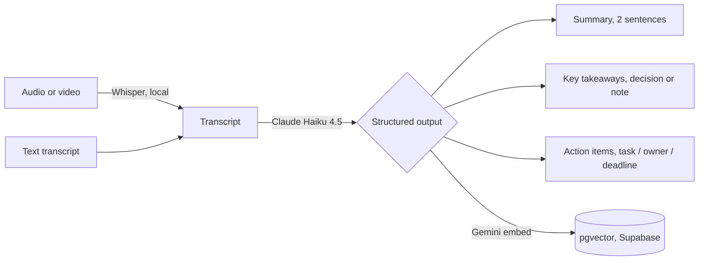
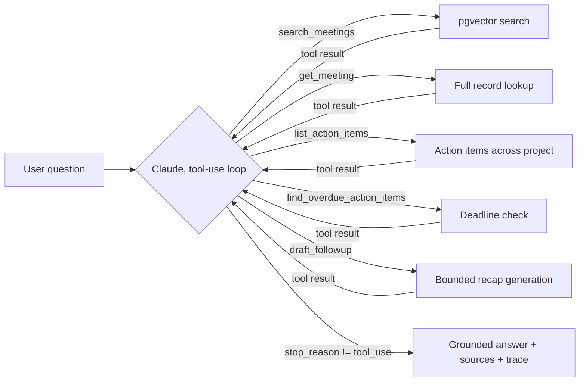

<div align="center">

# SummarAI

### Turn any meeting recording into a summary, decisions, and owned action items.




</div>

---

## What it is

SummarAI is a web app that turns a meeting recording into a written record people actually use. You upload an audio file (or paste a transcript), and within a couple of minutes it gives back three things: a two-sentence summary, the key takeaways (each marked as a **decision** or a **note**), and a list of **action items** showing the task, who owns it, and any deadline. Results can be saved into **projects**, so a team keeps a history of what was agreed across all their meetings.

Once meetings are saved to a project, you can **ask the meeting agent** in natural language — "what's overdue?", "who owns the design task?", "draft a recap" — and get a grounded, cited answer. This is a single tool-using agent: Claude loops over a small toolbox (semantic search, full-record lookup, action-item listing, overdue detection, follow-up drafting) for up to 5 steps, then answers only from what the tools returned.

The goal was not to build another transcription tool. Plenty of those exist. SummarAI reads the conversation and pulls out the parts that matter after the call: the decisions, the to-dos, and the institutional memory across meetings.

## Example output

A real run on a short product-sync meeting:

<div align="center">

</div>

## How it works

The system has two layers: a **core summarisation pipeline** that runs on every upload, and a **RAG layer** that activates once meetings are saved to a project.

### Core pipeline



1. **Speech to text.** `faster-whisper` (the `base.en` model) transcribes the audio locally on the CPU. If you upload a text transcript, this step is skipped.
2. **Summarise and extract.** The transcript goes to Claude Haiku 4.5 with a strict output schema, which guarantees the result is always a clean summary, typed takeaways, and action items.
3. **Embed and store.** When a result is saved to a project, the full summarisation record is embedded with Gemini `embedding-001` (1536-dimensional vectors) and stored in Supabase via the `pgvector` extension. This feeds the RAG layer.

### Agent layer — Ask the meeting agent



`POST /api/projects/{project_id}/ask` ([`run_agent()`](src/app.py)) runs a single tool-using agent, not a multi-agent system — chosen for explainability and demo safety. The loop:

1. Claude receives the question, the system prompt, and five tool definitions.
2. If it requests a tool, the backend executes it (semantic search over pgvector, a full-record lookup, an action-item listing/filter, a deadline-based overdue check, or a bounded follow-up-email draft) and returns the result.
3. This repeats until Claude stops requesting tools, or `MAX_AGENT_STEPS` (5) is reached — whichever comes first.
4. The final answer, the meetings it cited, and the full tool-call trace are returned together. The frontend's **Ask the meeting agent** panel renders the answer, source chips, and a collapsible step-by-step trace.

**Guardrails:**
- `MAX_AGENT_STEPS = 5` — a hard cap that prevents infinite reasoning loops.
- Every tool is read-only or a single bounded generation call (`draft_followup`) — there is no irreversible action the agent can take.
- The system prompt requires every claim to be grounded in tool output and instructs the agent to explicitly decline rather than guess when nothing relevant is found (verified in [`data/eval/evaluate_agent.py`](data/eval/evaluate_agent.py)).
- `find_overdue_action_items` only flags items with a parseable ISO date — vague deadlines ("next meeting") are skipped rather than assumed overdue.

## Results

The agent layer is evaluated with an **LLM-as-judge** approach, since there's no fixed reference answer for free-form Q&A over a project's meeting history — [`data/eval/evaluate_agent.py`](data/eval/evaluate_agent.py) scores each answer against the agent's own tool-call trace:

| Metric | Score |
|---|---|
| Faithfulness (LLM judge) | 1.00 |
| Answer relevancy (LLM judge) | 1.00 |
| Avg. latency per question | ~4.5s |
| Tool calls within step cap (5) | 100% |
| Declines ungrounded questions without hallucinating | Yes |

Run it with `.venv/bin/python data/eval/evaluate_agent.py <project_id>` against a project with a few saved meetings.

## Features

- Upload audio or video (`.mp4`, `.mp3`, `.wav`, `.m4a`, `.webm`, `.ogg`, `.flac`) or a text transcript (`.txt`, `.md`, `.vtt`, `.srt`).
- Local transcription — the audio never leaves your machine.
- Two-sentence summary, plus takeaways tagged decision or note, plus action items with owner and deadline.
- Save results into projects with a timeline view.
- **Ask the meeting agent** — a tool-using Claude agent answers questions, lists/filters action items, flags overdue tasks, and drafts follow-up recaps, all grounded and with a visible step-by-step trace.
- Clean, responsive interface that works on a phone, with a collapsible projects panel.

## Tech stack

| Part | Choice |
|---|---|
| Backend | Python, FastAPI ([`src/app.py`](src/app.py)) |
| Transcription | [`faster-whisper`](https://github.com/SYSTRAN/faster-whisper), `base.en`, local CPU |
| Summarisation | Claude Haiku 4.5, structured JSON output |
| Agent | Claude Haiku 4.5, bounded tool-use loop (single agent, 5 tools, `MAX_AGENT_STEPS=5`) |
| Embeddings | Gemini `embedding-001` (1536 dims, via `google-genai`) |
| Vector search | Supabase + `pgvector`, HNSW index, cosine similarity |
| Frontend | Single-page vanilla JavaScript and CSS ([`src/static/index.html`](src/static/index.html)) |
| Persistence | Supabase (Postgres) |

## Run it locally

```bash
git clone https://github.com/tono2002/gen-ai-project.git
cd gen-ai-project
python3 -m venv .venv && source .venv/bin/activate
pip install -r requirements.txt
cp .env.example .env          # then fill in your keys (see below)
uvicorn src.app:app --reload
```

Open `http://localhost:8000`, drop in a recording, and click Summarise.

### Environment variables

Open `.env` and set:

```
ANTHROPIC_API_KEY=sk-ant-...      # required — summarisation + agent
GEMINI_API_KEY=AIza...            # required for the agent/RAG — get free at aistudio.google.com
SUPABASE_URL=https://...          # optional — defaults ship in app.py
SUPABASE_ANON_KEY=eyJ...          # optional — defaults ship in app.py
```

### Database setup (for the agent/RAG layer)

Run, in order, in the Supabase SQL Editor:

1. [`supabase_schema.sql`](supabase_schema.sql) — base tables (`projects`, `summarizations`) and RLS policies.
2. `create extension if not exists vector;` — enables pgvector (not on by default on a fresh Supabase project).
3. [`supabase_schema_rag.sql`](supabase_schema_rag.sql) — adds the `embedding` column, HNSW index, and the `match_summarizations` search function used by `search_meetings`.

If you saved meetings before applying step 2/3 (or before `GEMINI_API_KEY` was set), back-fill their embeddings with `.venv/bin/python embed_existing.py`.

**Getting a Gemini API key:** go to [aistudio.google.com](https://aistudio.google.com), sign in with a Google account, and click **Get API key**. The free tier allows 1,500 embedding requests per day.

### Troubleshooting

| Symptom | Fix |
|---|---|
| `anthropic.AuthenticationError` | The key in `.env` is missing or wrong — check it at console.anthropic.com. |
| `ANTHROPIC_API_KEY is not set` | You started the server before creating `.env`, or in a different shell. Confirm `.env` exists in the project root and restart. |
| `GEMINI_API_KEY is not set` | Add `GEMINI_API_KEY=AIza...` to `.env`. The app starts without it, but the agent/Ask panel will return an error. |
| Ask panel returns "No relevant meetings found" | The meeting was saved before the agent/RAG migration, or before the embedding RLS update policy was added. Run `.venv/bin/python embed_existing.py` to back-fill. |
| First audio upload hangs for a minute | It's downloading the Whisper model (~150 MB) — only happens once. |
| Transcription feels slow | Set `WHISPER_MODEL=tiny.en` in `.env` for a faster, slightly less accurate model. |

## Deliverables

| Deliverable | Where |
|---|---|
| Project explainer (architecture, rubric mapping, Q&A prep) | [deliverables/project_explainer.html](deliverables/project_explainer.html) |
| Agent evaluation (LLM-judge, latency, guardrails) | [data/eval/evaluate_agent.py](data/eval/evaluate_agent.py) |
| Prompt documentation | [prompts/system_prompt.md](prompts/system_prompt.md) |

## Honest limitations

- **It does not know who is speaking.** The transcription has no speaker labels, so when nobody is named the action-item owner is left blank rather than guessed. This is the clearest thing to improve next.
- **It assumes English audio.** The transcription model is tuned for English.
- **Audio quality matters.** Heavy noise, strong accents, or people talking over each other lower transcription accuracy, and that carries through to the summary.
- **The agent requires saved meetings.** The Ask panel only returns answers once meetings have been saved to a project. Meetings saved before the agent/RAG migration was applied can be back-filled using `embed_existing.py`.
- **Single agent, by design.** The agent uses one Claude loop with a fixed toolbox rather than multiple autonomous agents — this keeps behaviour explainable and avoids inter-agent coordination failures, at the cost of not parallelising independent sub-tasks.


